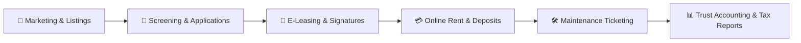

  

# 🏢 Awesome Residential Property Management

  
  
  
  
  
  

## 🌐 The Curated Residential Property Management & PropTech Ecosystem

> **A comprehensive, SEO-optimized directory of leading commercial SaaS platforms and open-source GitHub projects for residential property managers, landlords, and real estate operators.**  
> *Covering Single-Family Rentals (SFR), Multi-Family Portals, Online Rent Collection, Automated Tenant Screening, Digital Leases, Maintenance Work Orders, and Trust Accounting.*

**📅 Last updated:** September 2026

---

## 📑 Table of Contents

- [🌟 Overview & Ecosystem Context](#-overview--ecosystem-context)
- [🏢 SaaS / Hosted Commercial Platforms](#-saashosted-commercial-platforms)
  - [📊 Market Size & Industry Structure](#-market-size--industry-structure)
  - [💼 SaaS Comparison & Pricing Matrix](#-saas-comparison--pricing-matrix)
- [🔓 Open-Source GitHub Projects](#-open-source-github-projects)
- [⚖️ SaaS vs. Open-Source: Evaluation Framework](#️-saas-vs-open-source-evaluation-framework)
- [🛠️ Key Functional Capabilities in Residential PMS](#️-key-functional-capabilities-in-residential-pms)
- [📈 Star History](#-star-history)
- [🤝 How to Contribute](#-how-to-contribute)
- [📄 Disclaimer](#-disclaimer)

---

## 🌟 Overview & Ecosystem Context

Managing residential rental portfolios requires coordinating complex operational, legal, and financial workflows:
- **Tenant Lifecycle**: Rental marketing, syndicated listings, applicant screening (credit/criminal/eviction), state-compliant digital leases, and digital onboarding.
- **Financial Operations**: Automated bank ACH / card rent collection, late fee calculation, security deposit trust accounting, vendor payouts, and 1099 tax filing.
- **Maintenance & Facilities**: Tenant service requests, 24/7 emergency dispatch, vendor work order management, and recurring property inspections.
- **Stakeholder Portals**: Self-service resident web/mobile portals and real-time investor/owner reporting dashboards.

This directory tracks the leading **commercial SaaS solutions** (benchmarked by market valuation, transparent starting prices, and free tier terms) alongside production-ready and active **open-source GitHub repositories** (ranked strictly by community star count).

---

## 🏢 SaaS/Hosted Commercial Platforms 

### 📊 Market Size & Industry Structure

> 📈 **Market Size & Industry Structure:**  
> The global property management software market is estimated at **$3.8 billion to $5.2 billion in 2025–2026** and is projected to expand to **$7.5 billion–$8.5 billion by 2030**, reflecting a Compound Annual Growth Rate (CAGR) of **8.5% to 11.4%**. The sector remains **moderately to highly fragmented**, characterized by hundreds of specialized point solutions and SMB landlord tools coexisting with large enterprise incumbents (e.g., RealPage and AppFolio); ongoing private equity buyouts and cloud-platform mergers (such as TurboTenant acquiring TenantCloud and Thoma Bravo taking RealPage private) are driving steady movement toward moderate market concentration rather than an extreme winner-take-all monopoly.

### 💼 SaaS Comparison & Pricing Matrix

*Sorted descending by **Company Size (Valuation / Revenue)**.*

| 🏢 Platform | 📝 Description | 💼 Company Size (Valuation / Revenue) | 💰 Pricing | 🆓 Free Tier Limit |
| :--- | :--- | :--- | :--- | :--- |
| **[Propertyware](https://www.propertyware.com/)** | Enterprise-grade residential PMS purpose-built for single-family rentals (SFR) and scattered-site portfolios with customizable accounting, open REST APIs, and automated fee scheduling. | **$10.2B valuation / ~$1.2B+ revenue** (Flagship enterprise SFR platform under RealPage, acquired by Thoma Bravo for $10.2B) | Starts at **$1.00/unit/month** with a **$250/month minimum spend** + 2x monthly implementation fee (Basic plan, covers up to 250 units) • Plus: $1.50/unit/mo ($350/mo minimum) • Premium: $2.00/unit/mo ($450/mo minimum) | **15-day free trial** (limited-access trial upon form submission, no credit card required; allows testing core single-family management and accounting features; no permanent free plan). |
| **[Buildium](https://www.buildium.com/)** | Comprehensive residential property management platform with robust double-entry accounting, leasing tools, resident portals, and maintenance tracking for growing portfolios. | **$10.2B parent valuation ($580M acquisition) / ~$1.2B+ parent revenue** (Acquired by RealPage for $580M; operated under Thoma Bravo/RealPage) | Starts at **$62/month** (Essential plan, covers up to 50 units) • Growth: starts at $192/month • Premium: starts at $400/month | **14-day free trial** with full access to Essential and Growth features (accounting, resident center, maintenance, and leasing using sample or live data; no credit card required; no permanent free plan). |
| **[AppFolio](https://www.appfolio.com/)** | Feature-rich, AI-enhanced property management platform designed for mid-to-large portfolios, automating leasing, operations, maintenance dispatch, and portfolio accounting. | **~$7.5B – $7.9B market cap / $950.8M annual revenue** (Publicly traded on NASDAQ: APPF; FY2025 revenue: $950.8M with ~20% YoY growth) | Starts at **$1.40/unit/month** with a **$280/month minimum spend** (Core plan, requires 50-unit portfolio minimum) • Plus: $3.00/unit/month ($900/month minimum) • Max: $5.00/unit/month ($7,500/month minimum) | **No free-forever plan or self-service free trial**; offers a free guided interactive live demo with a product specialist (minimum portfolio of 50 units required for paid onboarding). |
| **[DoorLoop](https://www.doorloop.com/)** | Modern all-in-one residential property management software known for intuitive UX, rapid onboarding, tenant screening, automated rent collection, and QuickBooks synchronization. | **~$500M valuation / ~$20M–$35M ARR** (Raised $100M Series B in Oct 2024 led by JMI Equity; $130M total venture funding raised) | Starts at **$69/month** billed annually or **$99/month** billed monthly (Starter plan, up to 20 units; +$1.00/unit/mo thereafter) • Pro: starts at $139/month billed annually • Premium: starts at $209/month billed annually | **No free-forever plan or self-service free trial**; offers a free live 1-on-1 demo and a **30-day money-back guarantee** (applicable to Starter plan for up to 20 units). |
| **[Avail (by Realtor.com)](https://www.avail.co/)** | Landlord-focused software tailored for DIY landlords and smaller portfolios, providing syndicated listings, tenant screening, state-specific leases, and rent collection. | **~$44M acquisition / $15B+ parent market cap** (Acquired by Move, Inc. / Realtor.com, subsidiary of News Corp; Move Inc annual revenue ~$600M+) | Starts at **$0/month** (Unlimited free plan) • Unlimited Plus upgrade: **$9/unit/month** (or $7/unit/month billed annually) | **Free forever (Unlimited plan)** for unlimited units; includes syndicated listings across 19+ partner sites, background checks, state-specific leases, and rent collection (tenants pay standard $2.50 ACH fee or 3.5% card fee). |
| **[TurboTenant](https://www.turbotenant.com/)** | All-in-one landlord platform offering self-service rental marketing, application processing, tenant screening, and online rent collection with paid upgrades for state-specific leases. | **~$35M–$50M valuation / ~$10M–$12M annual revenue** (Raised $10.2M+ in funding; acquired competitor TenantCloud in Aug 2026; serves 600K+ landlords) | Starts at **$0/month** (Free plan) • Premium plan: **$149/year** (equivalent to approx. **$12.42/month** billed annually) | **Free forever** for unlimited properties and units; includes rental marketing, online applications, tenant screening (applicant pays), rent collection, and maintenance tracking. State-specific lease agreements cost $59/lease on the free plan (unlimited in Premium); no separate trial required. |
| **[TenantCloud](https://www.tenantcloud.com/)** | Cloud-based property management software offering listings syndication, tenant screening, online rent collection, digital lease agreements, and maintenance management. | **~$30M–$40M valuation / ~$10M–$20M revenue** (Acquired by TurboTenant in Aug 2026; raised $6.9M prior to acquisition across Seed and Series A) | Starts at **$15/month** billed annually or **$18/month** billed monthly (Starter plan, up to 10 leases and 1 GB storage) • Growth: $29.17/mo billed annually ($35/mo monthly, up to 30 leases) • Pro: $50/mo billed annually ($60/mo monthly, up to 60 leases) | **14-day free trial** with full access to Starter, Growth, or Pro plan features (up to plan limits during trial; no credit card required; no permanent free tier). |
| **[Rentec Direct](https://www.rentecdirect.com/)** | Full-featured residential property management platform with robust trust accounting, tenant screening, online payments, and work order tracking. | **~$30M–$40M estimated valuation / >$14M annual revenue** (Bootstrapped, debt-free, serving 25,000+ landlords and property managers managing millions of units) | Starts at **$25/month** (Rentec Starter, up to 10 units) • Rentec Pro: starts at $45/month for up to 10 units (+$1.25/unit/mo thereafter) • Rentec PM: starts at $55/month for up to 10 units (+$1.50/unit/mo thereafter) | **14-day free trial** with full access to all software features for up to 10 units (no setup fees, no credit card required; no permanent free tier). |
| **[Hemlane](https://www.hemlane.com/)** | Property management platform combining software automation with optional hands-on support (24/7 repair coordination and local leasing agents) for residential landlords. | **~$30M–$40M valuation / ~$9.1M ARR** (Raised $12M total funding, including a $9M Series A round) | Starts at **$0/month** (Starter free plan) • Basic (Paid): starts at **$30/month** ($28/mo base platform fee + $2/unit/month for 1 unit) • Essential: starts at $48/month ($28 base + $20/unit/mo) • Complete: starts at $86/month ($28 base + $58/unit/mo) | **Free forever (Starter plan)** limited to **1 property and 1 synced bank account** (includes rental advertising, applicant tracking, screening, and lease storage; excludes rent collection and repair coordination); or a **14-day free trial** on paid plans (Basic, Essential, Complete). |
| **[Innago](https://innago.com/)** | Clean, easy-to-use residential property management software designed for independent landlords, handling automated rent collection, digital leasing, and tenant communication. | **~$15M–$25M valuation / ~$3M–$5M annual revenue** (Raised $7.7M total funding; freemium landlord model monetized via tenant transaction fees) | **$0/month** (100% free for landlords; no monthly subscription, setup fee, or contract; optional pass-through tenant fees: $2.00 ACH/eCheck, 2.99% card fee, $30–$35 screening fee paid by applicants) | **Free forever for unlimited units, properties, and users** with full platform access (automated rent collection, lease signing, maintenance ticketing, tenant portal, and screening). No paid subscription tiers exist. |

---

## 🔓 Open-Source GitHub Projects

*Sorted descending by **GitHub Star Count**. Every Stars_Badge links directly to the repo's stargazers page.*

1. **[Microrealestate](https://github.com/microrealestate/microrealestate)**   
   **Self-Hosted Landlord & Lease Management Suite** — An open-source, full-stack rental property management platform designed for landlords to manage properties, units, tenants, digital leases, automated rent receipts, and payments. Features a modern web dashboard and Docker deployment. Built with Node.js, React, and MongoDB.

2. **[MicroCommunity](https://github.com/java110/MicroCommunity)**   
   **Microservices Residential Community PMS (HC)** — Enterprise-grade open-source property and residential community management system. Supports owner management, multi-community fee charging, maintenance work order ticketing, access control integration, and mobile tenant services. Built with Java and Spring Cloud.

3. **[Condo](https://github.com/open-condo-software/condo)**   
   **Modular Open-Source PMS & Resident Portal** — Modern open-source property management SaaS platform allowing property managers to manage resident contacts, tickets, properties, payments, invoices, and service marketplaces. Features a mini-app extension ecosystem for shared facilities. Built with TypeScript, Node.js, and GraphQL.

4. **[Real Estate Management](https://github.com/eevan7a9/real-estate-management)**   
   **Property Management & Tenant Collaboration Platform** — Connects landlords, property managers, and prospective tenants. Covers property listings, tenant applications, lease generation, maintenance request logging, and direct messaging. Built with PHP and JavaScript.

5. **[Movin' In](https://github.com/aelassas/movinin)**   
   **Full-Stack Rental Management with Mobile App** — Comprehensive residential and commercial property management system featuring a public booking portal, back-office administration, cross-platform mobile app, and native Stripe/PayPal payment gateway integrations. Built with Node.js, React, and React Native.

6. **[ResidenceCMS](https://github.com/Coderberg/ResidenceCMS)**   
   **Symfony 7 Property Management System** — Clean, open-source property management application tailored for apartment complexes, multi-unit buildings, and residential managers. Provides unit directories, resident tracking, expense ledgers, and maintenance scheduling. Built on PHP and Symfony 7.

7. **[OpenKos](https://github.com/senatroxx/OpenKos)**   
   **Open-Source Boarding & Rental PMS** — Lightweight property management software specifically created for boarding houses (kos), shared rentals, and apartment units. Features room occupancy calendars, recurring rent invoices, and tenant payment tracking.

8. **[WP-Property](https://github.com/wp-property/wp-property)**   
   **WordPress-Powered Property & Rental Framework** — Leading open-source WordPress plugin for managing residential listings, rental bookings, property attributes, search filters, and tenant inquiry pipelines directly on self-hosted WordPress sites.

9. **[SweetHome](https://github.com/Jubilee101/SweetHome)**   
   **Manager & Resident Communication System** — Dedicated property management tool built to streamline communication between building managers and residents, handling incident reporting, announcements, and maintenance request life cycles.

10. **[OCA / Odoo PMS](https://github.com/OCA/pms)**   
    **Odoo Community Property Management Suite** — The official Odoo Community Association (OCA) PMS module. Extends Odoo ERP with property asset hierarchies, lease agreement workflows, tenant invoicing, and double-entry real estate accounting.

11. **[ORPMS](https://github.com/orpms/orpms)**   
    **Open Real Estate Property Management System** — Community-driven platform designed to organize residential unit portfolios, tenant leases, automated payment reminders, and owner expense statements.

12. **[Utility Billing & Property Management](https://github.com/navariltd/utility-billing)**   
    **ERPNext Residential Property Extension** — Open-source Frappe/ERPNext app that introduces residential property leasing, tenant management, sub-meter utility billing, and automated recurring rent invoices.

13. **[OpenProperty](https://github.com/clawnify/OpenProperty)**   
    **Self-Hosted Commercial PMS Alternative** — Self-hosted property management software created as an alternative to TenantCloud, AppFolio, and Buildium for managing properties, units, tenants, digital leases, rent payments, and work orders.

---

## ⚖️ SaaS vs. Open-Source: Evaluation Framework

| Evaluation Criteria | 🏢 Commercial SaaS Platforms | 🔓 Self-Hosted Open-Source |
| :--- | :--- | :--- |
| **Target Audience** | Professional PM companies, institutional portfolios, DIY landlords wanting zero dev overhead | Software engineers, privacy-centric landlords, organizations needing custom integrations |
| **Tenant Screening** | Integrated TransUnion/Experian/Equifax background, credit, and eviction reports | Requires custom API integration (e.g., RentPrep, Checkr) |
| **Rent Collection & Banking** | Automated NACHA bank ACH, credit/debit card processing, and instant merchant payouts | Requires self-configured Stripe, PayPal, or Plaid accounts |
| **Legal Compliance** | State-specific, attorney-approved lease templates and Fair Housing audit logs | Landlord must supply and legally verify all lease templates and disclosures |
| **Maintenance Dispatch** | 24/7 emergency contact centers, automated vendor assignment, and tenant push notifications | Internal ticketing and email/SMS webhooks; requires self-managed vendor workflows |
| **Hosting & Maintenance** | 99.9% cloud SLA, SOC 2 compliance, automated daily backups, vendor updates | Self-managed VPS (Docker, Kubernetes, Linux), self-hosted database backups and security patches |
| **Total Cost of Ownership (TCO)** | Predictable monthly/per-unit subscription or tenant transaction pass-through fees | $5–$25/mo VPS hosting costs + development and system administration time |

---

## 🛠️ Key Functional Capabilities in Residential PMS

When evaluating software for residential rental management, ensure the platform covers the critical pillars:

1. **📢 Listings Syndication**: 1-click publishing to Zillow, Trulia, Realtor.com, HotPads, and Facebook Marketplace.
2. **🔎 Screening & Credit Checks**: Instant criminal history, nationwide eviction searches, credit scores, and income verification.
3. **📝 E-Signature & Document Vault**: Digital state-specific lease agreements, pet addenda, and lease renewal notifications.
4. **💳 Payment Processing**: Automated tenant recurring ACH, debit/credit cards, and split payments with automated late fees.
5. **🛠️ Maintenance Dispatch**: Tenant photo/video work order submission, status tracking, contractor bidding, and invoice reconciliation.
6. **📊 Trust & Tax Accounting**: Strict separation of tenant security deposits from operational funds, bank reconciliation, and 1099-MISC/1099-NEC tax generation.

---

## 📈 Star History

---

## 🤝 How to Contribute

Contributions are welcome! Please follow these guidelines:

1. Fork the repository.
2. Verify that any SaaS product added includes **specific starting pricing**, **free tier / trial limits**, and **estimated company size (valuation/revenue)**.
3. Verify that any Open-Source repository is active, relevant to residential property management, and includes a social Stars_Badge:
   ``
4. Ensure entries are sorted in descending order according to the section standard (Company Size for SaaS; Star Count for Open-Source).
5. Submit a Pull Request with a clear, factual explanation of the addition.

⭐ **Star the repo if you find it helpful!**

---

## 📄 Disclaimer

- This repository is a **community-curated index** created strictly for informational and educational purposes — not an endorsement of any product or vendor.
- Residential property management involves legal leases, financial transactions, tenant screening reports (regulated by the FCRA), security deposits, and local landlord-tenant regulations (such as Fair Housing laws). Self-hosted or open-source solutions require stringent data protection, regular backups, and legal oversight. Always consult certified legal, tax, and property management professionals.

---

  <b>Built with ❤️ for residential landlords, property managers, and PropTech innovators.</b> 
  Keeping residential operations organized, transparent, and digitally efficient.

